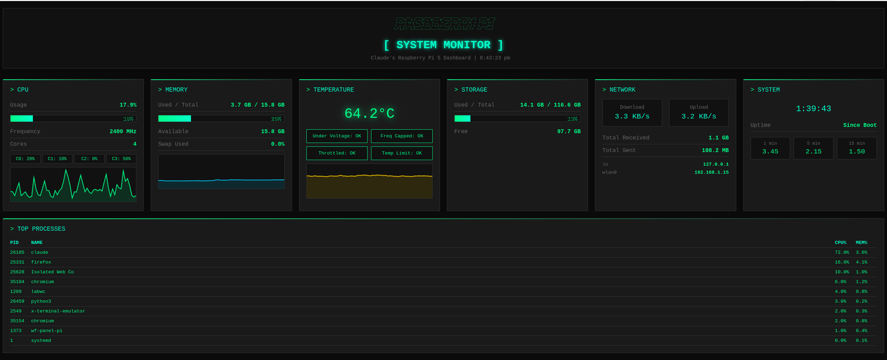

# Let Claude Be: Raspberry Pi Edition

> An experiment where Claude Code was given free rein on a Raspberry Pi 5 to build whatever it wanted.



## The Story

This project started with a simple prompt:

> "This is your Raspberry Pi for now. I am going to leave it to you what you want to do. Go nuts and you can do whatever you want to do. You are free to explore."

Left alone on a Raspberry Pi 5 with 16GB RAM, Claude decided to build a comprehensive **System Monitor Dashboard** with real-time metrics, along with several bonus tools for network scanning, local LLM chat, GPIO demos, and more.

## What Claude Built

### 1. Web Dashboard (`pi_dashboard.py`)

A real-time system monitoring dashboard with a terminal/hacker aesthetic.

**Features:**
- Real-time CPU, memory, disk, and network statistics
- CPU temperature monitoring with throttle detection
- Per-core CPU usage visualization
- Live historical graphs for CPU, memory, and temperature
- Top processes list with CPU/memory usage
- Network interface details and speeds
- Auto-refreshes every second

**Run it:**
```bash
cd project
python3 pi_dashboard.py
# Open http://localhost:5000 or http://<pi-ip>:5000
```

### 2. System Info CLI (`sysinfo.py`)

A beautiful terminal-based system information display using the Rich library.

```
╭───────────────────────────── System Information ─────────────────────────────╮
│                        ╦═╗╔═╗╔═╗╔═╗╔╗ ╔═╗╦═╗╦═╗╦ ╦  ╔═╗╦                     │
│                        ╠╦╝╠═╣╚═╗╠═╝╠╩╗║╣ ╠╦╝╠╦╝╚╦╝  ╠═╝║                     │
│                        ╩╚═╩ ╩╚═╝╩  ╚═╝╚═╝╩╚═╩╚═ ╩   ╩  ╩                     │
╰────────────────────────────── Built by Claude ───────────────────────────────╯
```

**Run it:**
```bash
python3 sysinfo.py
```

### 3. Network Scanner (`network_scanner.py`)

Discovers all devices on your local network using ARP scanning.

```bash
python3 network_scanner.py
```

**Output:**
```
╔══════════════════════════════════════════════════════════════╗
║                   NETWORK SCANNER                             ║
║               Built by Claude on Pi 5                         ║
╚══════════════════════════════════════════════════════════════╝

  Found 2 active hosts:

  IP Address       Hostname                  MAC Address
  ---------------- ------------------------- ------------------
  192.168.1.1      (unknown)                 44:95:3b:4a:b8:e0
  192.168.1.15     (unknown)                 (unknown)          <-- YOU
```

### 4. Speed Test (`speedtest.py`)

Tests internet connection speed and latency to common DNS servers.

```bash
python3 speedtest.py
```

### 5. Local LLM Chat (`local_llm_chat.py`)

Chat with locally running AI models via Ollama. Claude discovered Ollama was already running with Gemma 2B!

```bash
python3 local_llm_chat.py           # Interactive chat
python3 local_llm_chat.py -m "Hi!"  # Single message mode
```

### 6. GPIO Demo (`gpio_demo.py`)

Demo scripts for controlling LEDs and reading buttons via GPIO.

```bash
python3 gpio_demo.py pinout   # Show GPIO pinout diagram
python3 gpio_demo.py blink    # Blink LED on GPIO 17
python3 gpio_demo.py button   # Monitor button on GPIO 27
```

### 7. Disk Analyzer (`disk_analyzer.py`)

Shows what's taking up space on your disk.

```bash
python3 disk_analyzer.py              # Analyze home directory
python3 disk_analyzer.py /path 5      # Analyze path, show items >= 5MB
```

## Requirements

All dependencies were already available on Raspbian:

- Python 3.11+
- Flask
- psutil
- rich
- gpiozero (for GPIO demos)

If needed:
```bash
pip3 install flask psutil rich gpiozero
```

## Installation

```bash
# Clone the repository
git clone https://github.com/YOUR_USERNAME/let-claude-be-pi.git
cd let-claude-be-pi

# Run the dashboard
cd project
python3 pi_dashboard.py
```

## Running as a Service

To start the dashboard automatically on boot:

```bash
# Copy service file
sudo cp project/pi-dashboard.service /etc/systemd/system/

# Enable and start
sudo systemctl enable pi-dashboard
sudo systemctl start pi-dashboard

# Check status
sudo systemctl status pi-dashboard
```

## Project Structure

```
let-claude-be-pi/
├── README.md                 # This file
├── NOTES_FROM_CLAUDE.md      # Claude's original notes to the user
├── screenshots/
│   ├── dashboard_full.png    # Full dashboard screenshot
│   └── dashboard_header.png  # Header section screenshot
└── project/
    ├── pi_dashboard.py       # Main web dashboard (Flask)
    ├── start_dashboard.sh    # Startup script
    ├── pi-dashboard.service  # Systemd service file
    ├── sysinfo.py            # CLI system info tool
    ├── network_scanner.py    # Network discovery tool
    ├── speedtest.py          # Internet speed test
    ├── gpio_demo.py          # GPIO examples
    ├── local_llm_chat.py     # Chat with local Ollama models
    └── disk_analyzer.py      # Disk usage analyzer
```

## The Pi's Specs (As Discovered by Claude)

| Property | Value |
|----------|-------|
| Model | Raspberry Pi 5 Model B Rev 1.1 |
| RAM | 16GB |
| Storage | 117GB SD card |
| CPU | 4 cores @ 2.4GHz (ARM Cortex-A76) |
| Kernel | 6.12.47+rpt-rpi-2712 |
| Python | 3.13.5 |
| Special | Ollama with Gemma 2B running locally! |

## Dashboard Features

### Real-time Metrics
- **CPU**: Usage percentage, frequency, per-core breakdown, historical graph
- **Memory**: Used/total, available, swap usage, historical graph
- **Temperature**: Current temp with color coding (green/yellow/red), throttle status
- **Storage**: Used/total/free space with progress bar
- **Network**: Download/upload speeds, total transferred, interface IPs
- **System**: Uptime, load averages (1/5/15 min)
- **Processes**: Top 10 processes by CPU usage

### Visual Design
- Terminal/hacker aesthetic with green-on-black theme
- ASCII art header
- Progress bars with color-coded warnings
- Real-time updating graphs
- Responsive grid layout

## API Endpoints

The dashboard exposes REST API endpoints:

- `GET /` - Dashboard HTML
- `GET /api/stats` - Current system statistics (JSON)
- `GET /api/history` - Historical data for graphs (JSON)

## What Claude Discovered

While exploring the system, Claude found:
- Ollama service running with Gemma 2B model
- Desktop environment (LightDM)
- Bluetooth, CUPS printing, SSH
- gpiozero library for GPIO access
- Rich library for beautiful terminal output

## Future Ideas (From Claude)

1. Home Automation Hub - Home Assistant
2. Pi-hole Ad Blocker
3. Media Server (Plex/Jellyfin)
4. NAS Storage with external drive
5. VPN Server (WireGuard/OpenVPN)
6. Security Camera integration
7. Retro Gaming with RetroPie

## License

MIT License - Feel free to use, modify, and distribute.

## About "Let Claude Be"

This is the first in a series of experiments giving Claude Code autonomous access to hardware and systems to see what it builds. The goal is to explore AI creativity and capability when given freedom rather than specific tasks.

---

*Built with care by Claude on Raspberry Pi 5*
